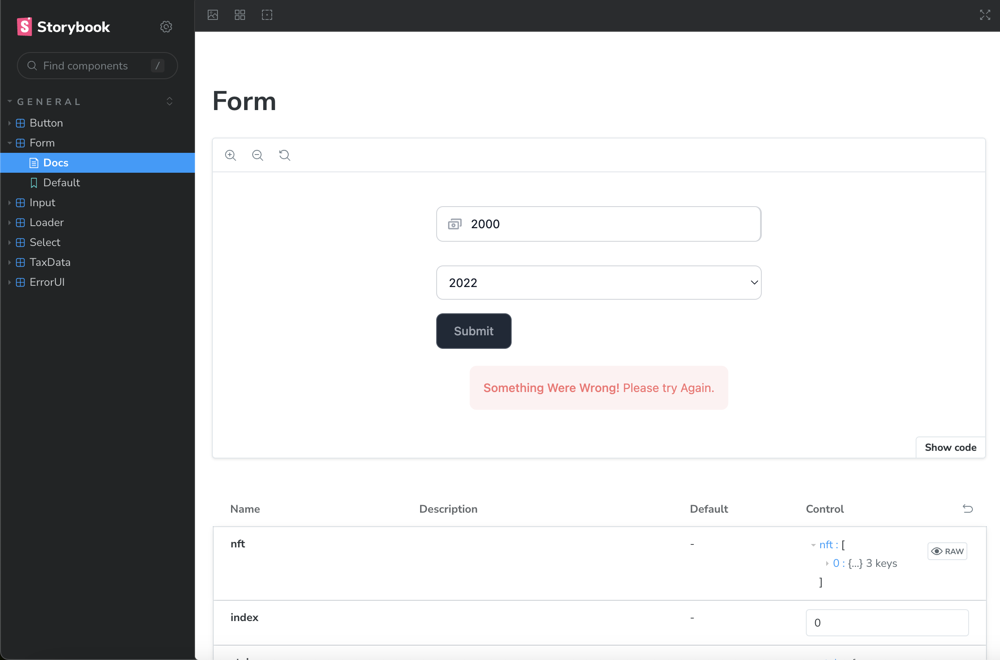
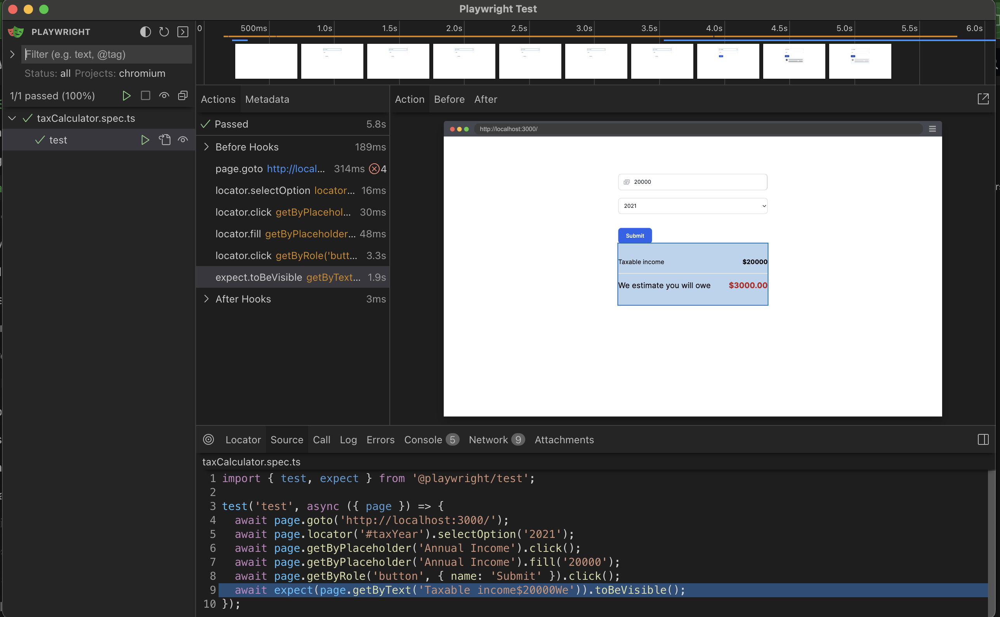

# Pre requisites

```
- Docker
- Node v20
- yarn
- make
```

# Api Installation

```
- make install
```

# Run Api locally

```
- make run
- goes to http://localhost:8000/tax-calculator/tax-year/{tax_year}
```

# Install Local App

```
- yarn
- yarn dev
```

```
- npm install
- npm run dev
```

# Run Local Server

```
- yarn dev
```

```
- npm run dev
```

# Run a deploy

```
- yarn build
- yarn start
```

```
- npm run build
- npm start
```

# Run storybook

```
- yarn storybook
- goes to : http://localhost:6006/
```

```
- npm run storybook
- goes to : http://localhost:6006/
```



# Run E2E

```
- yarn test:e2e
```

```
- npm run test:e2e
```


